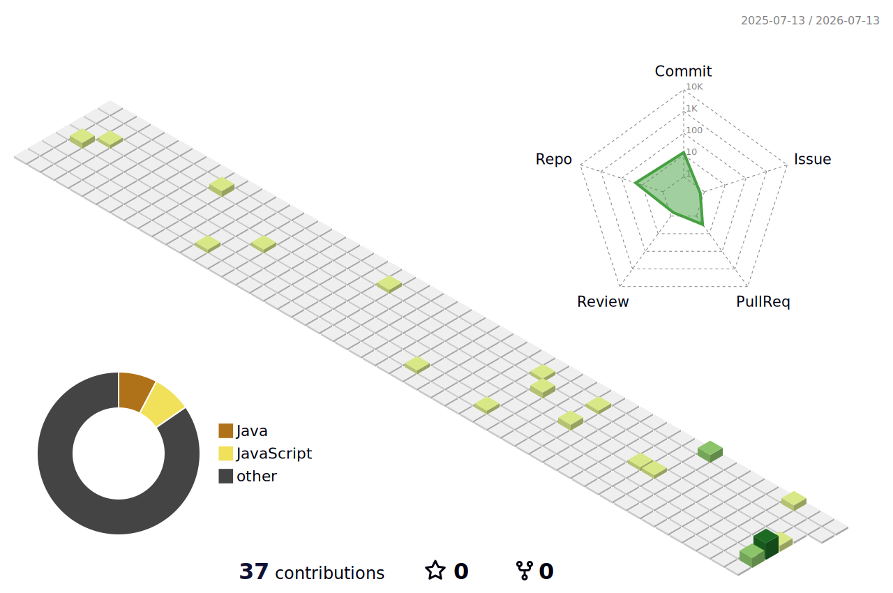

<div align="center">

<!-- ============ BANNER ============ -->
<!-- Replace assets/banner/banner.png with your own anime + text banner (Canva/Photopea).
     GitHub markdown can't render blur/matrix-rain/gradients natively, so the cleanest
     way to get that exact look is a single designed image here. -->


<!-- If you don't have a banner image yet, use this animated typing header instead -->
<!--
<a href="https://github.com/Adizz20">
  
</a>
-->

### "Every commit is another chance to improve." — Arata Kaizaki (ReLIFE)

</div>

<br/>

<!-- ============ STATUS BAR ============ -->
> **Status**: Still Learning... &nbsp;|&nbsp; **Mission**: Building cool things &nbsp;|&nbsp; **Focus**: AI • Web Dev • Problem Solving

<table align="center">
<tr>
<td>

**Confidence**
<br/>


</td>
<td>

**Coffee**
<br/>


</td>
<td>

**Sleep**
<br/>


</td>
</tr>
</table>

---

<!-- ============ INTRO + TERMINAL ============ -->
<table>
<tr>
<td width="45%" valign="top">

### 👋 Hello, Visitor!

I'm **Aditya Vikram Singh**, a Computer Science student who loves turning ideas into real-world solutions. Currently learning, building, debugging, and fighting with life (mostly bugs).

**🎯 Current Quests**
- 🟢 Building AI Projects — `IN PROGRESS`
- 🟢 Exploring Full Stack — `IN PROGRESS`
- 🟢 Solving DSA (Neetcode 150) — `IN PROGRESS`
- 🟡 Open Source — `IN PROGRESS`
- 🔴 Beating Procrastination — `HARD MODE`

</td>
<td width="55%" valign="top">

```bash
kaizaki@reboot:~$ sudo become-senior-developer

[sudo] password for kaizaki:
*********

Sorry, try again.

kaizaki@reboot:~$ sudo become-senior-developer

[sudo] password for kaizaki:
*********

Permission denied.
You need 5 more years of experience.

kaizaki@reboot:~$ _
```

</td>
</tr>
</table>

---

<!-- ============ QUICK FACTS ============ -->
### 📌 Quick Facts

| | |
|---|---|
| 📍 **Location** | India 🇮🇳 |
| 🎯 **Focus** | AI • Full Stack |
| 🎓 **Education** | CS Student (Year 3) |
| 💻 **OS** | Windows 11 |
| 🛠️ **Editor** | VS Code |
| 🌙 **Theme** | Dark (Always) |
| 🎮 **Hobbies** | Anime • Gym • Music |
| 💰 **Goal** | Financial Freedom |
| 🔁 **Motto** | 1% better everyday |

---

<!-- ============ NOW PLAYING / VISITORS / WAKATIME ============ -->
<table>
<tr>
<td width="33%" valign="top" align="center">

**🎧 Now Playing**

<!-- Live Spotify widget: deploy novatorem/spotify-github-profile
     (https://github.com/novatorem/spotify-github-profile) to Vercel,
     connect your Spotify account, then swap the URL below for your instance -->


*"Life is like a movie, make it legendary."* 🎬

</td>
<td width="33%" valign="top" align="center">

**👀 Visitors**


Thanks for stopping by! ⭐

</td>
<td width="33%" valign="top" align="center">

**⏱️ WakaTime Stats**

<!--START_SECTION:waka-->


**🐱 My GitHub Data** 

> 📦 37.5 kB Used in GitHub's Storage 
 > 
> 🏆 19 Contributions in the Year 2026
 > 
> 🚫 Not Opted to Hire
 > 
> 📜 22 Public Repositories 
 > 
> 🔑 4 Private Repositories 
 > 
**I'm a Night 🦉** 

```text
🌞 Morning                17 commits          ███░░░░░░░░░░░░░░░░░░░░░░   12.98 % 
🌆 Daytime                29 commits          ██████░░░░░░░░░░░░░░░░░░░   22.14 % 
🌃 Evening                68 commits          █████████████░░░░░░░░░░░░   51.91 % 
🌙 Night                  17 commits          ███░░░░░░░░░░░░░░░░░░░░░░   12.98 % 
```
📅 **I'm Most Productive on Wednesday** 

```text
Monday                   52 commits          ██████████░░░░░░░░░░░░░░░   39.69 % 
Tuesday                  2 commits           ░░░░░░░░░░░░░░░░░░░░░░░░░   01.53 % 
Wednesday                61 commits          ████████████░░░░░░░░░░░░░   46.56 % 
Thursday                 4 commits           █░░░░░░░░░░░░░░░░░░░░░░░░   03.05 % 
Friday                   1 commits           ░░░░░░░░░░░░░░░░░░░░░░░░░   00.76 % 
Saturday                 9 commits           ██░░░░░░░░░░░░░░░░░░░░░░░   06.87 % 
Sunday                   2 commits           ░░░░░░░░░░░░░░░░░░░░░░░░░   01.53 % 
```


📊 **This Week I Spent My Time On** 

```text
🕑︎ Time Zone: Asia/Kolkata

💬 Programming Languages: 
No Activity Tracked This Week

🔥 Editors: 
No Activity Tracked This Week

🐱‍💻 Projects: 
No Activity Tracked This Week

💻 Operating System: 
No Activity Tracked This Week
```

**I Mostly Code in JavaScript** 

```text
JavaScript               10 repos            ███████████░░░░░░░░░░░░░░   43.48 % 
Java                     5 repos             █████░░░░░░░░░░░░░░░░░░░░   21.74 % 
Python                   4 repos             ████░░░░░░░░░░░░░░░░░░░░░   17.39 % 
HTML                     3 repos             ███░░░░░░░░░░░░░░░░░░░░░░   13.04 % 
C++                      1 repo              █░░░░░░░░░░░░░░░░░░░░░░░░   04.35 % 
```


**Timeline**


 Last Updated on 09/07/2026 07:16:09 UTC
<!--END_SECTION:waka-->

</td>
</tr>
</table>

---

<!-- ============ GITHUB STATS ============ -->
### 📊 GitHub Stats

<table align="center">
<tr>
<td valign="top">

</td>
<td valign="top">

</td>
</tr>
</table>

<div align="center">

</div>

---

<!-- ============ SNAKE + 3D CONTRIBUTION GRAPH ============ -->
<table>
<tr>
<td width="50%" align="center">

**🐍 Snake Eating My Contributions**


*Watch me grow everyday 🌱*

</td>
<td width="50%" align="center">

**🏙️ 3D Contribution Graph**



*Hard work compounds.*

</td>
</tr>
</table>

---

<!-- ============ TECH STACK ============ -->
### 🧰 Tech Stack

**Languages**
<br/>


**Frameworks & Libraries**
<br/>


**Tools & Database**
<br/>


---

<!-- ============ ACTIVE PROJECTS ============ -->
### 🚀 Active Projects

| Project | Description | Status |
|---|---|---|
| 🧠 [Second Brain](https://github.com/Adizz20/Second-Brain) | Full-stack RAG app — Supabase + pgvector, Gemini embeddings, FastAPI, Next.js | `IN PROGRESS` |
| 🚗 Ride Sharing Backend | Scalable backend with microservices | `IN PROGRESS` |
| 📈 AI Stock Predictor | Predicting stocks using ML models | `IN PROGRESS` |
| 🎨 Portfolio Website | You are looking at it right now | `COMPLETED` |
| 🔐 Auth Service | Secure auth service with JWT/OAuth | `IN PROGRESS` |

More quests coming soon...

---

<!-- ============ LIFE STATUS ============ -->
### 📟 Life Status

| Stat | Bar | % |
|---|---|---|
| Motivation |  | 72% |
| Discipline |  | 68% |
| Patience |  | 41% |
| Social Life |  | 23% |
| Sleep |  | 12% |
| Luck |  | 33% |

```
Bugs in the system: Too many to count.
```

---

<div align="center">

*"If life gives you another chance, make the best out of it."*

`kaizaki@reboot:~$ exit`
<br/>
See you in the next commit! 👋 Take care and keep coding &lt;3 — Aditya

</div>
